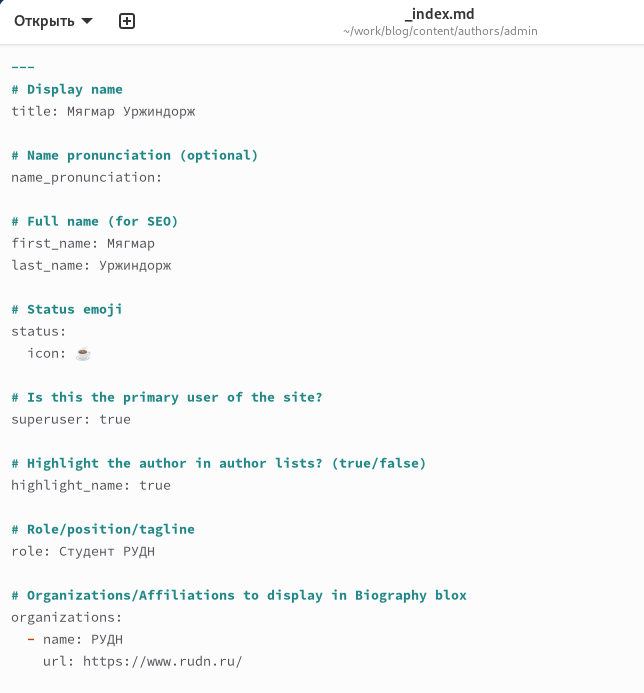

---
## Front matter
lang: ru-RU
title: Отчет по этапу №2 индивидуального проекта
subtitle: Операционные системы
author:
  - Уржиндорж Мягмар
institute:
  - Российский университет дружбы народов, Москва, Россия
date: 22 августа 2024

## i18n babel
babel-lang: russian
babel-otherlangs: english

## Formatting pdf
toc: false
toc-title: Содержание
slide_level: 2
aspectratio: 169
section-titles: true
theme: metropolis
header-includes:
 - \metroset{progressbar=frametitle,sectionpage=progressbar,numbering=fraction}
 - '\makeatletter'
 - '\beamer@ignorenonframefalse'
 - '\makeatother'
 
## Fonts
mainfont: PT Serif
romanfont: PT Serif
sansfont: PT Sans
monofont: PT Mono
mainfontoptions: Ligatures=TeX
romanfontoptions: Ligatures=TeX
sansfontoptions: Ligatures=TeX,Scale=MatchLowercase
monofontoptions: Scale=MatchLowercase,Scale=0.9
---

## Докладчик

:::::::::::::: {.columns align=center}
::: {.column width="70%"}

  * Уржиндорж Мягмар
  * Cтудент, 1 курс
  * Факультет физико-математических и естественных наук
  * Российский университет дружбы народов
  * [1032235131@pfur.ru](mailto:1032235131@pfur.ru)
  * <https://muagmar-urzhindorzh.github.io/>

:::
::: {.column width="30%"}

:::
::::::::::::::

## Цель работы

Целью данной лабораторной работы является приобретение навыков по добавлению информации о себе на сайт научного сотрудника и выполнение 2 этапа индивидуального проекта.

## Выполнение лабораторной работы

Первое, что я сделал, это добавил свою фотографию для аватара.

## Выполнение лабораторной работы

Затем заполнил информацию о себе.

## Выполнение лабораторной работы

Затем оформил пост по прошедшей неделе.

## Выполнение лабораторной работы

Оформил научный пост об управлении версиями git.

## Выполнение лабораторной работы

Отправляю файлы на сервер.

## Выполнение лабораторной работы

Просматриваю сайт по его абсолютному адресу и проверяю наличие изменений.

{#fig:006 width=70%}

## Выполнение лабораторной работы

{#fig:007 width=70%}

## Выполнение лабораторной работы

{#fig:008 width=70%}

## Выводы

В ходе выполнения данной лабораторной работы я приобрел навыки по добавлению информации о себе на сайт научного сотрудника и выполненил 2 этап индивидуального проекта.

