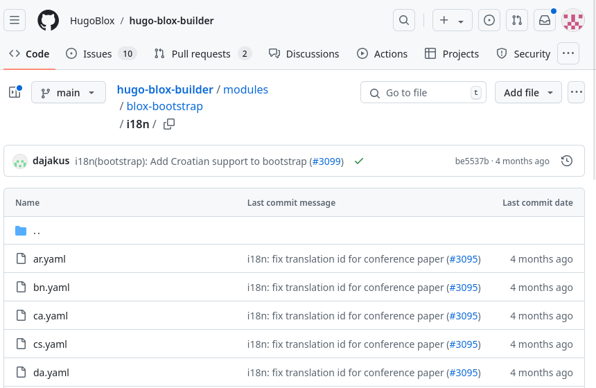
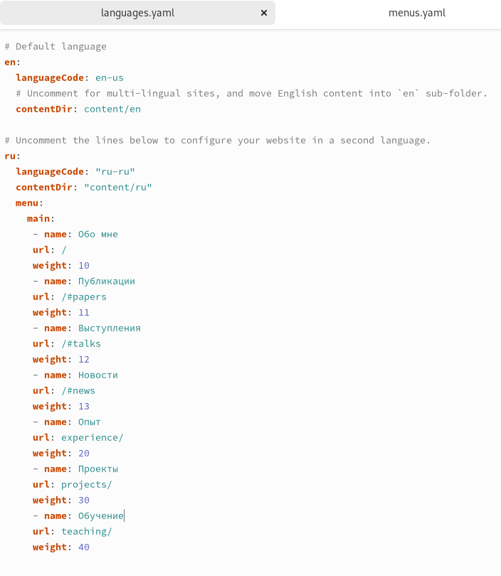
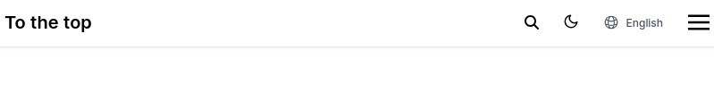
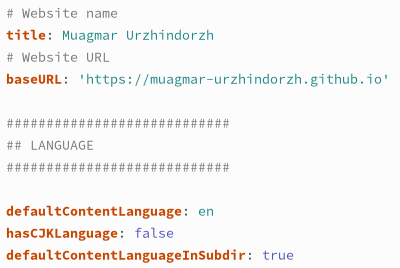
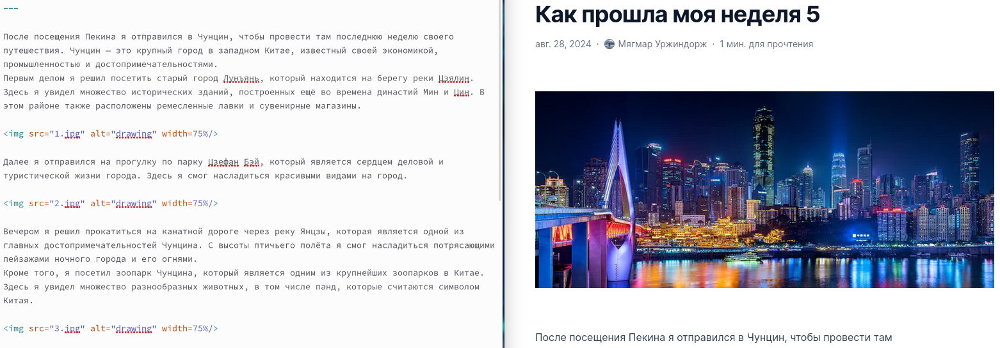

---
## Front matter
lang: ru-RU
title: Отчет по этапу №6 индивидуального проекта
subtitle: Операционные системы
author:
  - Уржиндорж Мягмар
institute:
  - Российский университет дружбы народов, Москва, Россия
date: 3 сентября 2024

## i18n babel
babel-lang: russian
babel-otherlangs: english

## Formatting pdf
toc: false
toc-title: Содержание
slide_level: 2
aspectratio: 169
section-titles: true
theme: metropolis
header-includes:
 - \metroset{progressbar=frametitle,sectionpage=progressbar,numbering=fraction}
 - '\makeatletter'
 - '\beamer@ignorenonframefalse'
 - '\makeatother'
 
## Fonts
mainfont: PT Serif
romanfont: PT Serif
sansfont: PT Sans
monofont: PT Mono
mainfontoptions: Ligatures=TeX
romanfontoptions: Ligatures=TeX
sansfontoptions: Ligatures=TeX,Scale=MatchLowercase
monofontoptions: Scale=MatchLowercase,Scale=0.9
---

## Докладчик

:::::::::::::: {.columns align=center}
::: {.column width="70%"}

  * Уржиндорж Мягмар
  * Cтудент, 1 курс
  * Факультет физико-математических и естественных наук
  * Российский университет дружбы народов
  * [1032235131@pfur.ru](mailto:1032235131@pfur.ru)
  * <https://muagmar-urzhindorzh.github.io/>

:::
::: {.column width="30%"}

:::
::::::::::::::

## Цель работы

Целью данной лабораторной работы является приобретение навыков по добавлению информации о себе на сайт научного сотрудника и выполнение 6 этапа индивидуального проекта.

## Выполнение лабораторной работы

Первое, что следует сделать, это зайти на [гитхаб hugo](https://github.com/HugoBlox/hugo-blox-builder/tree/main/modules/blox-bootstrap/i18n) и скачать файлы yaml нужных нам языков (напр. ru и en). Это нужно для автоматического перевода некоторых подзаголовков нашего сайта. Так же следует создать папки "en" и "ru" в blog/content и переместить туда весь контент (отдельно в en и ru). Скачанные файлы en.yaml и ru.yaml следует поместить в папки "en" и "ru" соответственно.

## Выполнение лабораторной работы

В файле blog/config/_default/languages.yaml добавляем строки для второго языка.

## Выполнение лабораторной работы

После запуска команды hugo server на сайте должна появиться кнопка переключения языков.

## Выполнение лабораторной работы

Перевожу весь контент сайта на английский язык (в content/en) и заливаю изменения на гитхаб.

## Выполнение лабораторной работы

В файле blog/config/_default/hugo.yaml нужно изменить параметр defaultContentLanguageInSubdir на true.

## Выполнение лабораторной работы

Пишу пост по прошедшей неделе.

## Выводы

В ходе выполнения данной лабораторной работы я приобрел навыки по добавлению информации о себе на сайт научного сотрудника и выполнил 6 этап индивидуального проекта.

