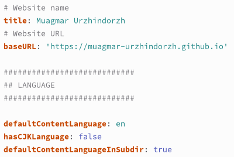

---
## Front matter
title: "Отчет по этапу №6 индивидуального проекта"
subtitle: "Операционные системы"
author: "Уржиндорж Мягмар"

## Generic otions
lang: ru-RU
toc-title: "Содержание"

## Bibliography
bibliography: bib/cite.bib
csl: pandoc/csl/gost-r-7-0-5-2008-numeric.csl

## Pdf output format
toc: true # Table of contents
toc-depth: 2
lof: true # List of figures
lot: true # List of tables
fontsize: 12pt
linestretch: 1.5
papersize: a4
documentclass: scrreprt
## I18n polyglossia
polyglossia-lang:
  name: russian
  options:
	- spelling=modern
	- babelshorthands=true
polyglossia-otherlangs:
  name: english
## I18n babel
babel-lang: russian
babel-otherlangs: english
## Fonts
mainfont: PT Serif
romanfont: PT Serif
sansfont: PT Sans
monofont: PT Mono
mainfontoptions: Ligatures=TeX
romanfontoptions: Ligatures=TeX
sansfontoptions: Ligatures=TeX,Scale=MatchLowercase
monofontoptions: Scale=MatchLowercase,Scale=0.9
## Biblatex
biblatex: true
biblio-style: "gost-numeric"
biblatexoptions:
  - parentracker=true
  - backend=biber
  - hyperref=auto
  - language=auto
  - autolang=other*
  - citestyle=gost-numeric
## Pandoc-crossref LaTeX customization
figureTitle: "Рис."
tableTitle: "Таблица"
listingTitle: "Листинг"
lofTitle: "Список иллюстраций"
lotTitle: "Список таблиц"
lolTitle: "Листинги"
## Misc options
indent: true
header-includes:
  - \usepackage{indentfirst}
  - \usepackage{float} # keep figures where there are in the text
  - \floatplacement{figure}{H} # keep figures where there are in the text
---

# Цель работы

Целью данной лабораторной работы является приобретение навыков по добавлению информации о себе на сайт научного сотрудника и выполнение 6 этапа индивидуального проекта.

# Задание

Размещение двуязычного сайта на Github.

- Сделать поддержку английского и русского языков.
- Разместить элементы сайта на обоих языках.
- Разместить контент на обоих языках.
- Сделать пост по прошедшей неделе.

# Выполнение лабораторной работы

Первое, что следует сделать, это зайти на [гитхаб hugo](https://github.com/HugoBlox/hugo-blox-builder/tree/main/modules/blox-bootstrap/i18n) и скачать файлы yaml нужных нам языков (напр. ru и en). Это нужно для автоматического перевода некоторых подзаголовков нашего сайта. Так же следует создать папки "en" и "ru" в blog/content и переместить туда весь контент (отдельно в en и ru). Скачанные файлы en.yaml и ru.yaml следует поместить в папки "en" и "ru" соответственно (рис. [-@fig:001]).

{#fig:001 width=70%}

В файле blog/config/_default/languages.yaml добавляем строки для второго языка (рис. [-@fig:002]).

{#fig:002 width=70%}

После запуска команды hugo server на сайте должна появиться кнопка переключения языков (рис. [-@fig:003]).

{#fig:003 width=70%}

Перевожу весь контент сайта на английский язык (в content/en) и заливаю изменения на гитхаб (рис. [-@fig:004]).

{#fig:004 width=70%}

В файле blog/config/_default/hugo.yaml нужно изменить параметр defaultContentLanguageInSubdir на true (рис. [-@fig:005]).

{#fig:005 width=70%}

Пишу пост по прошедшей неделе (рис. [-@fig:006]).

{#fig:006 width=70%}

# Выводы

В ходе выполнения данной лабораторной работы я приобрел навыки по добавлению информации о себе на сайт научного сотрудника и выполнил 6 этап индивидуального проекта.

